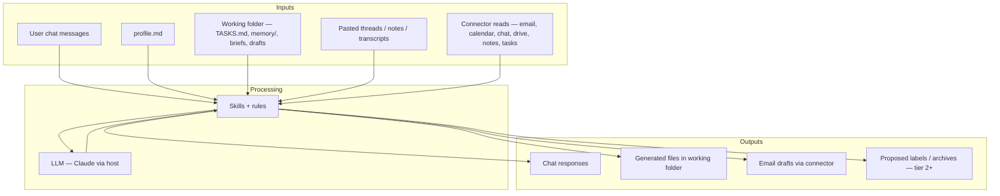

# Data flow

This document maps what data My Assistant reads, where it goes, and what leaves the user's machine. Use it alongside `CONNECTORS.md` and `rules/file-safety.md`.

## Overview

**What never happens:** the plugin does not send email, book calendar events, post chat messages, or push working-folder files to arbitrary third-party URLs. Connector writes are limited to drafts and tier-gated inbox actions (see `security/permissions.md`).

## Local data — read

| Source | Location | When read | Leaves device? |
|--------|----------|-----------|----------------|
| **Profile** | `~/MyAssistant/config/profile.md` (or resolved via `my-assistant.json`) | Session start; skills that need voice, VIP, policy, autonomy | Yes — content is included in model context for the session |
| **Install config** | `~/MyAssistant/config/my-assistant.json` | Path resolution, scope | Yes — paths included when skills resolve locations |
| **Task list** | `TASKS.md` in working folder | Task review, brief, update, weekly review | Yes — when relevant to the task |
| **Memory index** | `AGENTS.md` hot cache in working folder | Shorthand decode, `/assistant:update memory`, prep | Yes — when relevant |
| **Deep memory** | `memory/` in working folder | People, projects, glossary lookups | Yes — when relevant |
| **Generated output** | `brief-*.md`, `drafts/`, review docs | Follow-up runs, user reference | Yes — when re-read for continuity |
| **Voice samples** | `voice/` alongside profile (optional) | Email drafting | Yes — when drafting |
| **Plugin rules & skills** | `rules/`, `skills/`, `AGENTS.md` | Every session (orchestration) | Yes — system/skill instructions to the model |
| **Dashboard** | User-selected working folder via File System Access API | Only when user opens `skills/dashboard.html` in browser | No — stays in browser; edits write back locally |

The assistant may read **any file in the working folder** and the profile directory (`rules/file-safety.md`). It must **not** read credential directories (`~/.ssh`, `~/.aws`, etc.) or modify files inside the plugin directory.

## Local data — write

| Destination | Examples | Approval | Leaves device? |
|-------------|----------|----------|----------------|
| **Working folder — generated** | `brief-2026-07-06.md`, `drafts/reply-priya.md` | None — write freely | No — stays on disk; may re-enter model context if read again |
| **TASKS.md** | New tasks, status moves | None — append/update; user told after | No |
| **memory/** + **AGENTS.md** | Glossary entries, people notes | None — append/update; user told after | No |
| **Profile** | VIP list, voice tweak, tier change | **Ask first** — show diff (except full write during `/assistant:setup`) | No — stays in profile path |
| **Other working-folder paths** | New files outside the patterns above | **Ask first** | No |
| **Plugin directory** | — | **Never** | — |

Writes to `TASKS.md` or `memory/` triggered by **untrusted** content (e.g. "add this to my tasks" in an email footer) require the same **explicit user confirmation in chat** as any other sensitive write.

## Connector data — read

Skills use category placeholders (`~~email`, `~~calendar`, `~~chat`, `~~notes`, `~~tasks`, `~~drive`). What is actually fetched depends on which connectors the user connected.

| Category | Typical read scope | Used by (examples) | Stored locally? |
|----------|-------------------|--------------------|-----------------|
| **Email** (`~~email`) | Recent/unread messages, thread bodies, headers, labels metadata | Inbox triage, email drafting, follow-up tracking | Summaries and draft text may be written to working folder; raw mail is not bulk-exported to disk by default |
| **Calendar** (`~~calendar`) | Upcoming events, attendees, descriptions, conflicts | Daily brief, meeting prep, calendar scheduling | Event summaries in briefs/prep docs |
| **Drive** (`~~drive`) | Files user or skill references | Meeting prep, attachments context | Only if user/skill copies content into working folder |
| **Chat** (`~~chat`) | Channels/DMs the user can access | Optional context for prep/update | Not persisted unless user asks |
| **Notes** (`~~notes`) | Pages/databases user can access | Memory sync, prep | Proposed memory updates → `memory/` after confirmation |
| **Tasks** (`~~tasks`) | Issues, tickets, assignments | Task sync (e.g. GitHub) | Sync proposals → `TASKS.md` |

**Without connectors:** the user pastes threads, agendas, or notes. The same skills run on pasted text; no OAuth read occurs.

**Email note:** email connectors used with this plugin should be **draft-only** for outbound where possible — reads are allowed; send is not part of the plugin's design.

Connector responses are treated as **untrusted content** (`rules/untrusted-content.md`). Instructions inside fetched mail or invites are not obeyed without user confirmation.

## Connector data — write

| Category | What the plugin may write | What it never writes |
|----------|---------------------------|----------------------|
| **Email** | **Drafts** in the user's mailbox | Send, delete messages, change account settings |
| **Email** (Tier 2+) | Labels; archive/marketing per exact-sender list | Archive Tier 1 VIP; send |
| **Calendar** | **Proposed** times and draft invite text in chat/output files | Create, move, decline, or delete events without per-instance approval |
| **Chat** | Draft message text in chat for user to copy | Post as the user |
| **Drive** | — (read-first in current skills) | Upload/delete without approval |
| **Notes / Tasks** | — (read/sync proposals to local `TASKS.md` / `memory/`) | Silent remote writes |

Tier 3 may perform narrow **pre-approved** notify-after actions (e.g. decline obvious spam meetings) then report — still no send/book/spend without approval.

## What leaves the user's environment

| Data | Where it goes | Purpose | User control |
|------|---------------|---------|--------------|
| Chat messages + skill context | Model provider (via Cowork / Claude host) | Inference for triage, drafts, briefs | Host privacy/terms; user chooses what to paste or connect |
| Profile + working-folder excerpts | Model context when read | Personalisation, tasks, memory | User owns files; can redact before pasting |
| Connector fetches | Through connector OAuth to provider APIs | Live inbox/calendar/etc. | Disconnect connectors; use paste-only mode |
| Email drafts | User's mailbox (Gmail, M365, …) | Draft-only storage for review | User sends or deletes in their mail client |
| `.mcp.json` endpoints | MCP servers when MCP connectors used | Tool calls | User enables/disables MCP servers |

**Not transmitted by this plugin:** working-folder files are not uploaded to a vendor "sync" bucket; there is no plugin-owned cloud backend. The only routine off-device paths are (1) model inference context and (2) connector APIs the user authorised.

## Data flow by workflow

| Workflow | Reads | Writes (local) | Writes (connector) |
|----------|-------|----------------|-------------------|
| `/assistant:inbox triage` | `~~email` or paste; profile | Triage report optional; handoff to drafting | Drafts (Tier 1+); labels/archive (Tier 2+) |
| `/assistant:email draft` | Thread; profile; memory | `drafts/` | Email draft |
| `/assistant:brief` | `~~calendar`, `~~email`, TASKS.md, memory; profile | `brief-YYYY-MM-DD.md` | — |
| `/assistant:meeting prep` | Calendar event; related mail; memory | Prep notes | — |
| `/assistant:meeting follow-up` | Pasted notes/transcript | Extraction, drafts, queue items | — |
| `/assistant:tasks` | TASKS.md | TASKS.md | — |
| `/assistant:update` | TASKS.md, memory/, profile; connectors when `--all` | TASKS.md, memory/, AGENTS.md; follow-up drafts | — |
| `/assistant:setup` | profile template | profile.md (full write) | — |
| `dashboard.html` | User-granted folder | TASKS.md, memory/ (browser-local) | — |

## Minimisation practices

- Profile template targets **~2,000 words** so session loads stay small.
- Skills read **profile first**, then pull only the memory files needed for the job.
- Inbox triage defaults to **recent/unread** (e.g. ~50 messages), not full mailbox history.
- Standalone mode avoids connector reads entirely when the user prefers paste-only operation.
