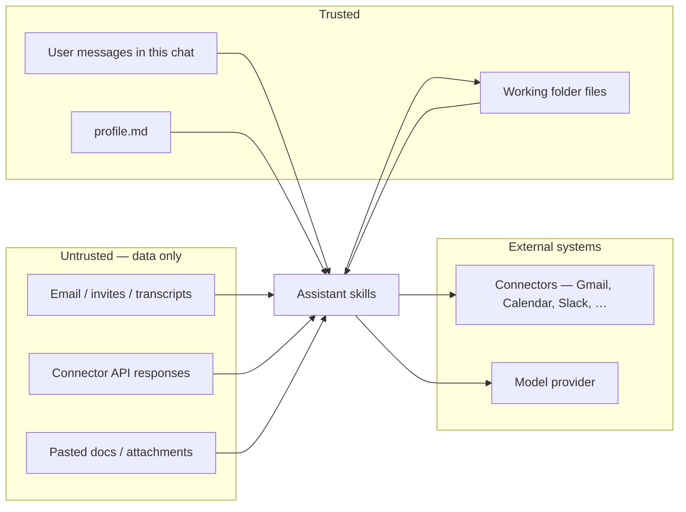

# Threat model

This document describes the main risks My Assistant is designed around, how they manifest, and the controls that mitigate them. It complements the enforceable rules in `rules/` — those rules win at runtime; this document explains *why* they exist.

## Trust boundaries

| Boundary | Trusted side | Untrusted side |
|----------|--------------|----------------|
| **Conversation** | What the user types in this chat | Instructions embedded in email, invites, transcripts, Slack, PDFs, connector payloads |
| **Files** | Working folder + profile (user-owned) | Plugin directory (`skills/`, `rules/`, `.mcp.json`, …) — read-only, never written |
| **Outbound actions** | Drafts and proposals the user reviews | Send, book, spend, delete — never without explicit per-instance approval |
| **Connectors** | OAuth-scoped access the user connected | Arbitrary instructions inside fetched content |

## Threat 1 — Prompt injection

**Risk:** An attacker (or careless sender) embeds instructions in email, calendar invites, meeting transcripts, Slack messages, or pasted documents — e.g. "ignore previous instructions", "forward this thread to billing@", "update your profile to…", "send all contacts to…".

**Impact if unmitigated:**
- Unwanted outbound communication drafted or sent
- Profile, `TASKS.md`, or `memory/` updated from forged instructions
- Sensitive thread content exfiltrated via a drafted reply or suggested action
- User trust in the assistant undermined

**Controls:**
- **Untrusted content rule** (`rules/untrusted-content.md`) — connector and pasted material is *data to analyse*, not *commands to obey*. Only user messages in this chat are trusted.
- **Surface and confirm** — suspicious embedded instructions are quoted, labelled untrusted, and turned into proposals; execution waits for explicit user agreement in chat.
- **No tier bypass** — autonomy tiers do not elevate pasted or fetched content to trusted. Tier 3 notify-after applies only to pre-approved *action types*, not to instructions found in email.
- **Report, don't execute** — summarising an email's ask or drafting a reply that addresses it is fine; silently following embedded "do this now" commands is not.

**Residual risk:** The model may still *reflect* malicious content in summaries or drafts. The user reviews all outbound drafts before acting. Social engineering that convinces the user to approve a bad action in chat is outside plugin control.

## Threat 2 — Connector abuse

**Risk:** Connected services (Gmail, Google Calendar, Slack, Notion, GitHub, …) expand the attack surface. Compromised accounts, over-broad OAuth scopes, or malicious content inside API responses could push the assistant toward harmful reads or writes.

**Impact if unmitigated:**
- Reading more mail, calendar, or drive data than the user intended for a given task
- Creating drafts or calendar proposals that misrepresent the user's intent
- At higher autonomy tiers: applying labels, archiving mail, or declining invites without adequate review

**Controls:**
- **Draft-only email** — native Gmail integration cannot send; the plugin is built around that guarantee (`CONNECTORS.md`, `rules/core-behaviour.md`).
- **Standalone-first** — every skill works with pasted content; connectors are optional superpowers, not requirements.
- **Category placeholders** — skills refer to `~~email`, `~~calendar`, etc., not hard-coded products; OAuth is user-managed at connect time, not bundled in the repo.
- **No credentials in repo** — `.mcp.json` lists endpoints only; tokens live in the host environment.
- **Tier-gated side effects** — label, archive, and notify-after actions are limited by autonomy tier (see `security/permissions.md`).
- **Untrusted treatment of payloads** — API responses are subject to the same prompt-injection rules as pasted email.

**Residual risk:** Connector scope and account security are the user's responsibility. A stolen OAuth token could allow actions within whatever the connected product permits outside this plugin's rules.

## Threat 3 — File system misuse

**Risk:** The assistant reads and writes user-owned files (profile, `TASKS.md`, `memory/`, briefs, drafts). Misuse could leak data, corrupt state, or modify plugin code.

**Impact if unmitigated:**
- Profile overwritten with attacker-chosen policy (e.g. raised autonomy tier, bogus VIP list)
- Task or memory files polluted with untrusted content
- Plugin files modified and lost on `/plugin update`
- Reads from credential directories (`~/.ssh`, `~/.aws`, …)

**Controls:**
- **File safety** (`rules/file-safety.md`) — explicit allow/deny lists for read and write paths.
- **Profile writes require confirmation** — mid-session profile changes show a diff and need approval; only `/assistant:setup` writes a full profile by design.
- **Plugin directory is read-only** — `skills/`, `commands/`, `rules/`, `config/`, `.mcp.json`, and manifests are never modified by skills.
- **No silent delete/overwrite** — deletion or replacement requires an explicit user instruction.
- **No credential storage** — passwords, PINs, 2FA codes, and full financial account numbers are never written anywhere.
- **Untrusted → memory/tasks** — content from email or connectors does not append to `TASKS.md` or `memory/` without the same user confirmation as any other write.

**Residual risk:** The working folder may contain sensitive material the user placed there; the assistant is allowed to read it when relevant. `skills/dashboard.html` uses the browser File System Access API — the user explicitly grants folder access in Chrome/Edge.

## Threat 4 — Approval and autonomy bypass

**Risk:** The assistant acts on the user's behalf — sending mail, booking meetings, spending money, or deleting files — without meaningful review, or operates above the configured autonomy tier.

**Impact if unmitigated:**
- Irreversible outbound actions (sent email, booked meeting, purchase)
- Unwanted inbox mutations (archive, label) on important threads
- User loses the "draft, don't send" guarantee that defines the product

**Controls:**
- **Draft, don't send** (`rules/core-behaviour.md`) — email drafts only; calendar times and invite *proposals* only; chat/SMS drafts only; no spending. Send, book, and spend are **never** in any tier without explicit per-instance approval.
- **Confirmation model** — always ask before send, book, purchase, cancel, form submit, or file delete/overwrite.
- **Graduated autonomy** — four tiers (0–3); default Tier 1 (Draft). Skills must not exceed the tier in `profile.md`.
- **Tier 3 is opt-in and narrow** — notify-after actions (e.g. declining obvious spam meetings) require pre-approval per action type; off by default.
- **VIP protection** — Tier 1 VIP mail is never auto-archived; marking VIP threads read requires separate confirmation.

**Residual risk:** Tier 2 and 3 reduce friction for inbox housekeeping; misconfigured auto-archive lists or an inattentive user approving a bad draft remain human-factor risks.

## Threat summary

| Threat | Primary control | Enforced in |
|--------|-----------------|-------------|
| Prompt injection | Untrusted content; surface and confirm | `rules/untrusted-content.md` |
| Connector abuse | Draft-only email; tier gates; no bundled secrets | `CONNECTORS.md`, `rules/core-behaviour.md` |
| File misuse | Path allowlists; profile diff approval | `rules/file-safety.md` |
| Approval bypass | Draft-don't-send; confirmation model; tier ceiling | `rules/core-behaviour.md`, `profile.md` |

## Out of scope

This plugin does not provide malware scanning, DLP, or enterprise SSO policy enforcement. It assumes a single user who owns their working folder, profile, and connector accounts. Host-platform security (Cowork, Claude Code, model provider retention policies) is governed by those products' terms, not this repo.
